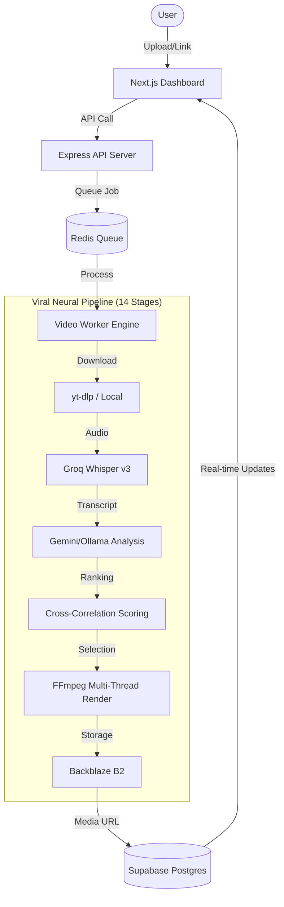

# 🌌 Excerpt: AI-Driven Video Viralization Engine - Master Documentation

## 🚀 Project Overview & Mission
**Excerpt** is a production-grade platform designed to automate the conversion of long-form video content into high-impact, viral short-form clips. By leveraging a complex multi-stage AI pipeline and high-performance video processing, Excerpt identifies "hooks," transcribes content with minimal latency, and crops footage for professional 9:16 vertical distribution.

The project mission is to provide creators with a "Godmode" editing companion that combines advanced linguistic reasoning (LLMs) with precise frame-accurate rendering (FFmpeg).

---

## 🛠 Tech Stack

### Frontend (Cyber-Premium UI)
- **Framework**: [Next.js 14](https://nextjs.org/) (App Router)
- **Styling**: Vanilla CSS + [Tailwind CSS](https://tailwindcss.com/)
- **Animations**: [Framer Motion](https://www.framer.com/motion/) & [GSAP](https://gsap.com/)
- **Icons**: [Lucide React](https://lucide.dev/)
- **State**: React Hooks + Supabase Real-time

### Backend & Orchestration
- **API Server**: Node.js + [Express.js](https://expressjs.com/) (TypeScript)
- **Queue System**: [Redis](https://redis.io/) (BullMQ)
- **Database**: [Supabase](https://supabase.com/) (Postgres + Auth)
- **Storage**: [Backblaze B2](https://www.backblaze.com/b2/cloud-storage.html) (S3-Compatible)

### AI & Pipeline
- **ASR (Speech-to-Text)**: [Groq](https://groq.com/) (Whisper-large-v3) - Sub-second latency transcription.
- **Reasoning (VLM/LLM)**: [Google Gemini 1.5 Flash](https://deepmind.google/technologies/gemini/) & [Ollama](https://ollama.com/) (Qwen2.5-Coder:7b) for local processing.
- **Video Processing**: [FFmpeg](https://ffmpeg.org/) (Fluent-FFmpeg) for cropping, merging, and rendering.

---

## 🏗 System Architecture



---

## 🧠 The 14-Stage Viral Pipeline
The core logic resides in `viral_pipeline.py`, featuring a reinforced orchestration layer:

| Stage | Name | Description |
| :--- | :--- | :--- |
| **0** | **Input** | URL/Path validation and duration extraction. |
| **1** | **Transcript** | High-speed ASR extraction via Groq Whisper. |
| **2** | **Hook Intel** | Initial assessment of the hook's viral potential. |
| **3** | **Segment Gen** | Breaking video into logical chunks for analysis. |
| **4** | **Audio Analysis** | Scanning for high-energy/clear dialogue. |
| **5** | **Visual Analysis** | Tracking entities, whiteboards, and faces. |
| **6** | **Ranking** | Cross-correlation of audio, visual, and hook scores. |
| **7** | **Thumbnail** | Frame-stepping to find the most cinematic frame. |
| **8** | **Hook Rewrite** | (Parallel) LLM rewriting segments for higher retention. |
| **9** | **Metadata** | (Parallel) Automated title, captions, and hashtag generation. |
| **10** | **Quality Guard** | Final automated check before rendering. |
| **11** | **Persistence** | Writing video files and SRT subtitles to disk. |
| **12** | **Learning** | Feedback loop for weight optimization. |
| **13** | **Quality Audit** | Verification of file existence and integrity. |

---

## 📁 Directory Structure & Key Files

```text
excerpt/
├── apps/
│   ├── web/                # Next.js Frontend
│   │   ├── src/components/ # Premium UI Components (Dashboard, Hero, etc.)
│   │   └── src/app/        # App Router pages
│   └── api/                # Express Backend & Jobs
│       ├── src/services/   # Core Logic (AI, Storage, Supabase)
│       └── src/workers/    # Queue Consumers (Video Processing)
├── packages/
│   └── types/              # Unified TypeScript interfaces
├── scripts/                # Deployment and setup utilities
├── viral_pipeline.py       # Main Python orchestration pipeline
├── Dockerfile              # Multi-target build configuration
└── docker-compose.yml      # Local dev/prod infrastructure
```

### Key Logic Files
- [viral_pipeline.py](file:///c:/Projects/Ashishlabs/Excerpt/viral_pipeline.py): The 14-stage processing brain.
- [supabaseService.ts](file:///c:/Projects/Ashishlabs/Excerpt/apps/api/src/services/supabaseService.ts): Main DB interaction layer.
- [aiService.ts](file:///c:/Projects/Ashishlabs/Excerpt/apps/api/src/services/aiService.ts): Orchestrator for Gemini and Groq calls.
- [videoProcessor.ts](file:///c:/Projects/Ashishlabs/Excerpt/apps/api/src/services/videoProcessor.ts): FFmpeg heavy-lifting.

---

## 🛡️ Reliability & Test Suite
The project includes a rigorous suite of scripts to ensure production stability:
- **Stress Testing**: `test_ollama_reliability.py` & `ollama_stress_test.py`.
- **Pipeline Resilience**: `test_pipeline_resilience.py` & `test_viral_resilience_hardened.py`.
- **Quality Audit**: `test_quality_audit.py` - Verifies output integrity.
- **Scaling**: `test_pipeline_scaling.py` - Benchmarks concurrent job handling.

---

## ⚡ Setup & Development
1. **Global Install**: `npm install`
2. **Environment**: Configure `.env` with Supabase, Groq, and B2 keys.
3. **Start Stack**: `docker-compose up -d` or `npm run dev` (local).
4. **Access**:
   - Frontend: [http://localhost:3010](http://localhost:3010)
   - API: [http://localhost:8010](http://localhost:8010)
   - Redis Insight: [http://localhost:8005](http://localhost:8005)

---

Built with precision for the future of vertical content. 🚀
