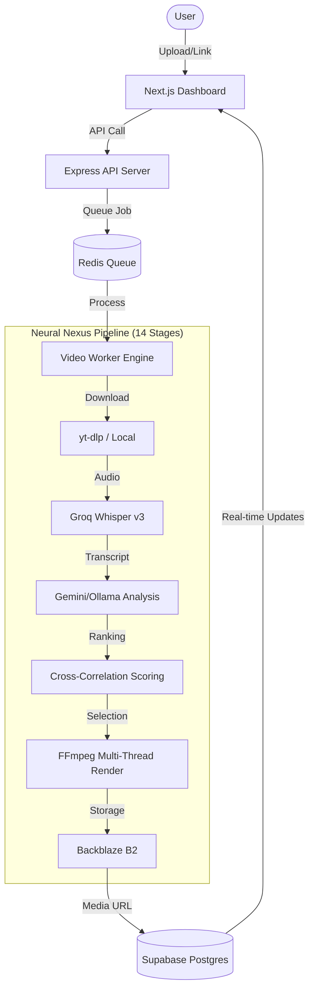

# 🌌 Excerpt: AI-Driven Video Viralization Engine

[](https://nextjs.org/)
[](https://expressjs.com/)
[](https://supabase.com/)
[](https://deepmind.google/technologies/gemini/)
[](https://www.backblaze.com/b2/cloud-storage.html)

**Excerpt** is a production-grade platform designed to automate the conversion of long-form video content into high-impact, viral short-form clips. By leveraging a complex multi-stage AI pipeline and high-performance video processing, Excerpt identifies "hooks," transcribes content with minimal latency, and crops footage for professional 9:16 vertical distribution.

---

## ✨ Key Features

- 💎 **Cyber-Premium UI & Advanced Editor**: A futuristic dashboard with glassmorphism, real-time processing metrics, and a fully-featured non-linear Clip Editor with trim handles, zoomable timeline, and persistent keyboard-accessible controls.
- 🧠 **Neural Nexus Pipeline**: A 14-stage orchestration engine that coordinates ASR, LLM reasoning, and computer vision.
- 🎯 **Cinematic Smart Cropping**: Automated 9:16 vertical cropping powered by face tracking and visual activity detection, with visual overlays in the editor.
- 📝 **AI Captions & Keywords**: Dynamic, animated caption generation with SEO-optimized metadata, and interactive transcript viewing and editing.
- 🔄 **Real-time Synchronization**: Supabase-backed persistence with real-time updates for job status and clip metrics.
- 🛡️ **Enterprise Resilience & Security**: Distributed worker concurrency with stale job reclamation, strict BOLA/IDOR endpoint hardening, SSRF DNS-pinning protection, rate-limiting, and comprehensive JWT middleware.

---

## 🏗 System Architecture



---

## 🧠 The 14-Stage Viral Pipeline

The core logic resides in `viral_pipeline.py` and the `NexusRegistry`, featuring a reinforced orchestration layer:

| Stage | Name | Description |
| :--- | :--- | :--- |
| **0** | **Input** | URL/Path validation and duration extraction. |
| **1** | **Transcript** | High-speed ASR extraction via Groq Whisper v3. |
| **2** | **Hook Intel** | Initial assessment of the hook's viral potential. |
| **3** | **Segment Gen** | Breaking video into logical chunks for analysis. |
| **4** | **Audio Analysis** | Scanning for high-energy/clear dialogue (AudioIntelligence). |
| **5** | **Visual Analysis** | Tracking entities, whiteboards, and visual flow. |
| **5b** | **Cinematic Crop** | (Stage 5b) Face tracking and 9:16 framing (FaceTracking). |
| **6** | **Ranking** | Cross-correlation of audio, visual, and hook scores. |
| **7** | **Thumbnail** | Frame-stepping to find the most cinematic preview frame. |
| **8** | **Hook Rewrite** | LLM-driven hook refinement for higher retention. |
| **9** | **Metadata** | Automated title, captions, and hashtag generation. |
| **10** | **Quality Guard** | Final automated check before rendering. |
| **11** | **Persistence** | Writing video files and SRT subtitles to disk. |
| **12** | **Learning** | Pattern analysis loop for weight optimization. |
| **13** | **Quality Audit** | Verification of file existence and integrity. |

---

## 🛠 Tech Stack

### Frontend & Orchestration
- **Framework**: Next.js 14 (App Router)
- **Styling**: Vanilla CSS + Tailwind CSS
- **Animations**: Framer Motion & GSAP
- **State**: React Hooks + Supabase Real-time
- **Database**: Supabase (Postgres + Auth)
- **Queue**: Redis (BullMQ)

### AI & Media Processing
- **ASR**: Groq (Whisper-large-v3) - Sub-second latency.
- **Reasoning**: Google Gemini 1.5 Flash & Ollama (Local LLM).
- **Computer Vision**: OpenCV (Face Tracking).
- **Rendering**: FFmpeg (Fluent-FFmpeg) for multi-thread rendering.
- **Storage**: Backblaze B2 (S3-Compatible).

---

## 🚀 Getting Started

### 1. Environment Configuration
Create a `.env` file in the root directory with the following variables:

```env
# AI Services
GOOGLE_AI_API_KEY=your_gemini_key
GROQ_API_KEY=your_groq_key

# Database & Storage
SUPABASE_URL=your_supabase_url
SUPABASE_ANON_KEY=your_supabase_key
B2_KEY_ID=your_b2_id
B2_APPLICATION_KEY=your_b2_key
B2_BUCKET_NAME=excerpt-clips

# Infrastructure
REDIS_URL=redis://localhost:6380
NEXT_PUBLIC_API_URL=http://192.168.0.5:8010
```

### 2. Running via Docker (Recommended)
The platform is fully containerized for production parity.

```bash
# Start the full stack
docker-compose up -d --build
```

Access URLs:
- **Frontend**: [http://192.168.0.5:3010](http://192.168.0.5:3010) (or localhost:3010)
- **API Server**: [http://192.168.0.5:8010](http://192.168.0.5:8010)
- **Redis Insight**: [http://localhost:8005](http://localhost:8005)

### 3. Local Development
```bash
# Install dependencies
npm install

# Start all services concurrently
npm run dev
```

---

## 📁 Directory Structure

```text
excerpt/
├── apps/
│   ├── web/                # Next.js Dashboard & Studio Editor
│   └── api/                # Express Backend & Video Worker
│       ├── src/services/nexus/ # Neural Nexus Intelligence Modules
│       └── scripts/            # Python Intelligence Scripts (OpenCV)
├── packages/
│   └── types/              # Unified TypeScript Interfaces
├── viral_pipeline.py       # Main Orchestration Pipeline
└── docker-compose.yml      # Container Infrastructure
```

---

Built with precision for the future of vertical content. 🚀
