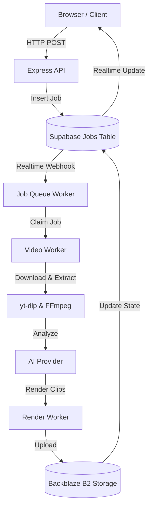
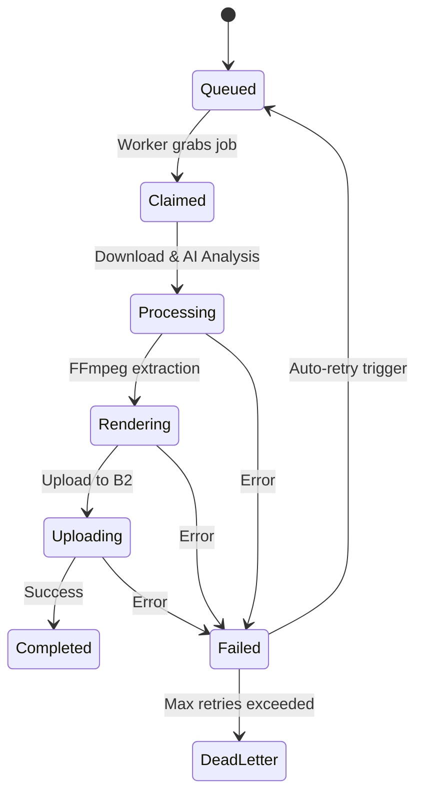
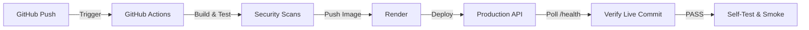

# Excerpt Architecture

This document describes the high-level architecture of the Excerpt platform, detailing the flow of data, worker lifecycles, and deployment topologies.

## System Overview

Excerpt relies on a Next.js frontend, an Express Node.js worker API, Supabase (PostgreSQL + Auth + Storage edge), and Backblaze B2 for long-term video artifact storage.

## Request Flow

## Worker Lifecycle

## Deployment Architecture

