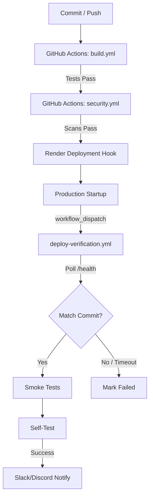

# Deployment Architecture

Excerpt utilizes a modern, verified CI/CD pipeline built on GitHub Actions and Render. 

## Flow

## Release Discipline
We use Semantic Versioning (SemVer) for production releases:
- `vX.Y.Z` (e.g., `v2.3.0`)
- **X (Major)**: Breaking API changes, major architectural shifts.
- **Y (Minor)**: New features, non-breaking schema additions.
- **Z (Patch)**: Security fixes, bug fixes, emergency patches.

Always tag releases in GitHub. The release tag automatically flows into the Dashboard Metadata.
